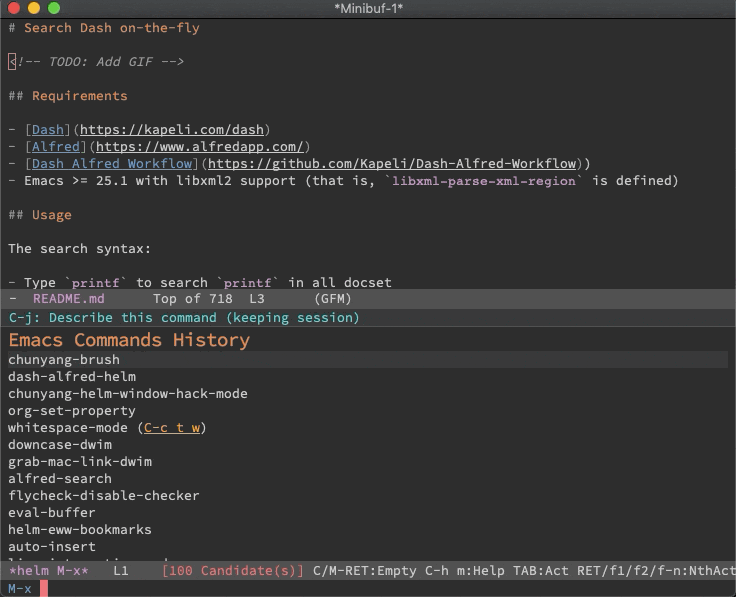

# Search Dash on-the-fly

## Requirements

- [Dash](https://kapeli.com/dash)
- [Alfred](https://www.alfredapp.com/)
- [Dash Alfred Workflow](https://github.com/Kapeli/Dash-Alfred-Workflow)
- Emacs >= 25.1 with libxml2 support (that is, `libxml-parse-xml-region` is defined)

## Usage

The search syntax:

- Type `printf` to search `printf` in all docset
- Type `php:printf` to search `printf` in the PHP docset

In the above `php` is the [Docset keyword](https://kapeli.com/dash_guide#docsetKeywords), you can edit it from Dash.app.

### `M-x dash-alfred-helm` (for Helm users)

Search Dash Documentation with Helm.

### `M-x dash-alfred-ivy` (for Ivy users)

Search Dash Documentation with Ivy.
